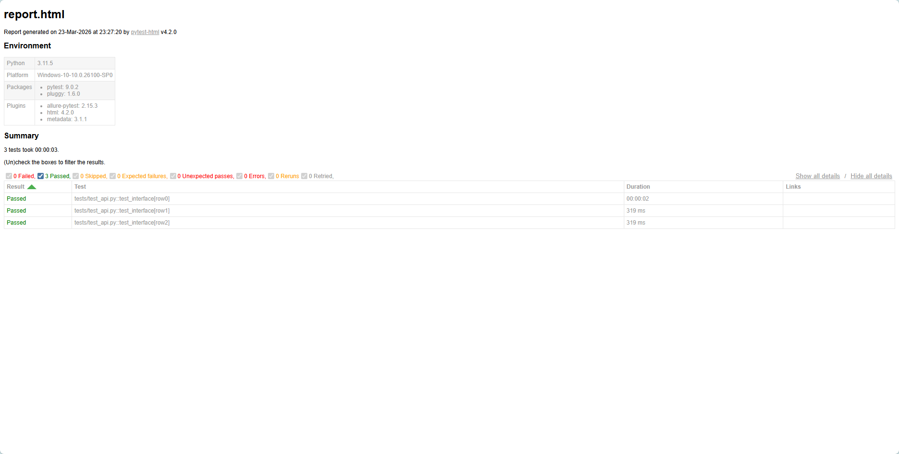

Python 接口自动化测试实战 Demo (Pytest + Requests)
📖 项目简介
本项目是一个基于 Python + Pytest + Requests + Pandas 的轻量级接口自动化测试框架。
采用 Data-Driven Testing (DDT) 模式，将测试逻辑与测试数据（Excel）完全分离，支持快速扩展测试用例，适用于中小型项目的集成测试与回归测试。

🛠️ 技术栈
核心框架：Pytest (用例组织与执行)

网络请求：Requests (封装 Session 持久化连接)

数据驱动：Pandas + Openpyxl (高效处理 Excel 用例)

报告集成：Allure / Pytest-html (可视化测试报告)

持续集成：兼容 GitHub Actions / Jenkins

📂 项目结构
Plaintext
python-api-auto-test-demo/
├── data/               # 测试数据中心
│   └── test_cases.xlsx # 核心：Excel 维护的接口测试用例
├── report/             # 测试报告输出
│   ├── allure_results/ # Allure 原始数据
│   └── report.html    # 独立的 HTML 报告
├── tests/              # 测试脚本层
│   └── test_api.py     # 自动化执行逻辑（参数化驱动）
├── utils/              # 工具类封装
│   ├── __init__.py
│   └── request_util.py # Requests 基础请求方法封装
├── requirements.txt    # 依赖管理
└── run_tests.py        # 一键启动脚本
🚀 快速开始
1. 安装依赖
建议在虚拟环境中执行：

Bash
pip install -r requirements.txt
2. 执行测试
运行所有接口测试用例并生成报告：

Bash
pytest tests/test_api.py -v --alluredir=report/allure_results --html=report/report.html --self-contained-html
3. 查看报告
轻量版：直接打开 report/report.html。

专业版 (Allure)：

Bash
allure serve report/allure_results
📊 测试报告展示
核心亮点：支持详尽的请求日志、通过率统计及失败原因追查。

1. Allure 概览

2. 数据驱动示例
项目支持从 Excel 动态加载如下字段进行测试：
| case_id | method | endpoint | goods_id | expected_status |
| :--- | :--- | :--- | :--- | :--- |
| 1 | POST | /post | 1001 | 200 |
| 2 | GET | /get | - | 200 |

💡 未来优化方向
[ ] 集成 Pydantic 进行响应体的 Schema 严格校验。

[ ] 增加 MySQL/Redis 工具类，支持数据库断言（后置校验）。

[ ] 配置 GitHub Actions 实现提交代码自动触发测试。

Author: cyorange66
Updated: 2026-03-24